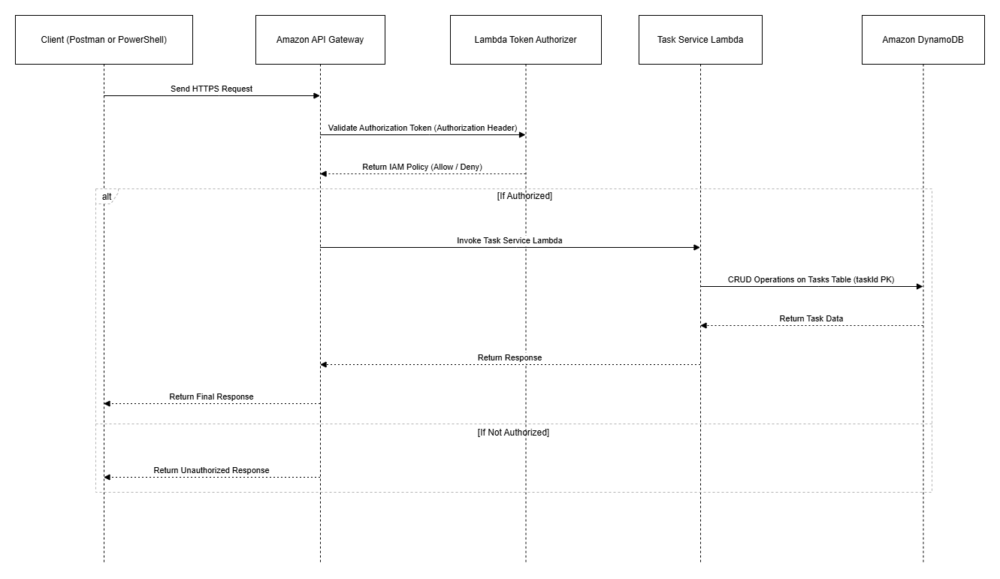

# Management Microservice (AWS Serverless, CDK)

A **production-style serverless task management microservice** built on AWS using **API Gateway, Lambda, DynamoDB, and AWS CDK (Python)**.

This portfolio project demonstrates **real-world cloud engineering practices**, including secure API design, Infrastructure as Code, and a clean migration from manual AWS Console prototyping to fully automated CDK deployment.

---

## 🧭 Project Background

This project intentionally reflects a **realistic cloud development lifecycle**:

1. Initial architecture prototyped manually using the AWS Console  
2. Debugging real-world AWS integration issues (IAM, Lambda, API Gateway)  
3. Final, production-ready implementation using **AWS CDK (Python)**  

Only the **CDK implementation** is deployed. Console-era experimentation is documented but intentionally excluded from deployment.

---

## ✨ What This Project Demonstrates

- Serverless backend architecture on AWS  
- Secure REST API design using a **custom Lambda Token Authorizer**  
- Full CRUD operations backed by DynamoDB  
- Infrastructure as Code with AWS CDK (Python)  
- Cost-aware cloud engineering with easy teardown (`cdk destroy`)  
- Clean migration from manual setup → reproducible deployment  

---

## 🏗 Architecture



### Request Flow

1. Client (Postman or PowerShell) sends an HTTPS request  
2. API Gateway invokes a Lambda Token Authorizer  
3. Authorization token is validated  
4. Authorized requests are routed to the Task Service Lambda  
5. Lambda performs CRUD operations on DynamoDB  
6. Response is returned to the client  

---

## 🔐 Authentication Model

- Custom **Lambda Token Authorizer**
- Token is passed via the `Authorization` header
- Token value is validated against an environment variable
- Requests without a valid token are denied

> ⚠️ This model is intentionally simple to demonstrate how API Gateway authorizers work internally.  
> In production, this could be replaced with **Cognito / OAuth / JWT**.

---

## 🧰 Tech Stack

- **Amazon API Gateway (REST API)**
- **AWS Lambda**
  - Task Service Lambda
  - Token Authorizer Lambda
- **Amazon DynamoDB**
- **AWS CDK (Python)**
- **CloudWatch Logs**

---

## 📁 Repository Structure

management-microservice/
│
├── cdk/ # Infrastructure as Code (AWS CDK)
│ ├── app.py
│ ├── management_microservice_stack.py
│ └── lambdas/
│ ├── management_service_handler.py
│ └── management_api_authorizer.py
│
├── docs/
│ └── architecture.png # Architecture diagram
│
├── .gitignore
└── README.md


> The `cdk/` directory represents the **authoritative, production-ready implementation**.

---

## 🚀 Deployment

### Prerequisites

- AWS CLI configured
- AWS CDK installed
- Python 3.10+

### Install Dependencies

```bash
python -m venv .venv
source .venv/bin/activate   # Windows: .venv\Scripts\activate
pip install -r requirements.txt

Bootstrap CDK (one-time per account/region)
cdk bootstrap aws://<ACCOUNT_ID>/<REGION>

Deploy
cdk deploy


After deployment, CDK outputs the API endpoint URL.

🧪 API Usage Examples (PowerShell)
$BASE_URL = "https://<api-id>.execute-api.<region>.amazonaws.com/dev"
$AUTH = "my-super-secret-token"

Create Task
$body = @{
  title = "First task"
  description = "Created via API"
  status = "PENDING"
} | ConvertTo-Json

Invoke-RestMethod -Method POST `
  -Uri "$BASE_URL/tasks" `
  -Headers @{ Authorization = $AUTH } `
  -ContentType "application/json" `
  -Body $body

List Tasks
Invoke-RestMethod -Method GET `
  -Uri "$BASE_URL/tasks" `
  -Headers @{ Authorization = $AUTH }

Get Task by ID
Invoke-RestMethod -Method GET `
  -Uri "$BASE_URL/tasks/{taskId}" `
  -Headers @{ Authorization = $AUTH }

Update Task
$update = @{ status = "IN_PROGRESS" } | ConvertTo-Json

Invoke-RestMethod -Method PUT `
  -Uri "$BASE_URL/tasks/{taskId}" `
  -Headers @{ Authorization = $AUTH } `
  -ContentType "application/json" `
  -Body $update

Delete Task
Invoke-RestMethod -Method DELETE `
  -Uri "$BASE_URL/tasks/{taskId}" `
  -Headers @{ Authorization = $AUTH }

💰 Cost Control / Cleanup

All billable AWS resources created by this project (Lambda, API Gateway, DynamoDB, IAM roles, and S3 assets) were explicitly deleted after testing to prevent ongoing charges.

During teardown, the CloudFormation stack entered a state where:

Application resources had already been removed

The CDK execution role was no longer assumable

The stack remained in an UPDATE_COMPLETE state with no active resources

As a result, the stack could not be deleted via CDK without re-bootstrapping the environment.
Because CloudFormation itself does not incur cost and no underlying resources remained, no further action was required.

🧠 Design Decisions

Started with AWS Console prototyping to validate architecture quickly

Migrated to CDK for repeatability and best practices

Used a custom authorizer to demonstrate deep API Gateway understanding

Chose DynamoDB for low-latency, serverless persistence

Explicit CORS handling for real-world API usage

🔮 Future Improvements

JWT-based authentication (Cognito / OAuth)

OpenAPI specification

CI/CD pipeline (GitHub Actions)

Structured logging & tracing

Unit and integration tests

⭐ Why This Project Matters

This repository demonstrates:

Real-world serverless backend architecture

Secure API design

Infrastructure as Code

AWS best practices

Cost-aware cloud engineering

Migration from manual setup to automated deployment

👤 Author

Daryoush
Cloud / Backend Engineering Portfolio Project

